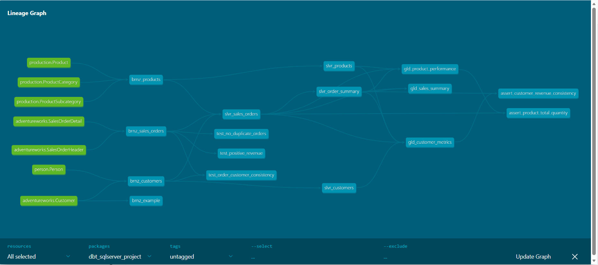

# DataOps Pipeline: DBT + Airflow + CI/CD

[](https://github.com/qnm1903/dbt_airflow-dataops/actions/workflows/deploy-dev.yml)
[](https://github.com/qnm1903/dbt_airflow-dataops/actions/workflows/deploy-prod.yml)

**Final Year DataOps Project**
*Automated data transformation pipeline with DBT, Airflow orchestration, and GitHub Actions CI/CD*

---

## 📋 Table of Contents

- [Project Overview](#-project-overview)
- [Features](#-features)
- [Architecture](#-architecture)
- [Tech Stack](#-tech-stack)
- [Quick Start](#-quick-start)
- [Project Structure](#-project-structure)
- [Data Pipeline](#-data-pipeline)
- [CI/CD Workflows](#-cicd-workflows)
- [Deployment](#-deployment)
- [Monitoring & Alerts](#-monitoring--alerts)
- [Development Guide](#-development-guide)
- [Troubleshooting](#-troubleshooting)

---

## 🎯 Project Overview

This project implements a production-grade DataOps pipeline that automates data transformation workflows using industry-standard tools. The pipeline extracts data from SQL Server (AdventureWorks 2014), transforms it through bronze/silver/gold layers using DBT, orchestrates execution with Apache Airflow, and deploys automatically via GitHub Actions CI/CD.

### Business Use Case

Transform raw sales, customer, and product data from AdventureWorks into analytics-ready datasets for business intelligence and reporting.

### Learning Outcomes

- ✅ Production-grade data pipeline implementation
- ✅ DataOps principles: CI/CD, automated testing, monitoring
- ✅ Containerization with Docker Compose
- ✅ Version control and collaboration with Git/GitHub
- ✅ Data quality frameworks and testing strategies
- ✅ Infrastructure as Code (IaC) practices

---

## ✨ Features

### Core Features
- **📊 3-Layer Data Architecture:** Bronze (raw) -> Silver (cleaned) -> Gold (aggregated)
- **🔄 Automated Orchestration:** Airflow DAGs with dependency management
- **✅ Data Quality Testing:** 126+ automated tests (schema, custom, relationships)
- **🚀 CI/CD Automation:** GitHub Actions for testing and deployment
- **📦 Containerized Infrastructure:** Docker Compose for all services
- **📈 Source Freshness Monitoring:** Track data staleness
- **🔔 Slack Notifications:** Real-time alerts for pipeline failures/success
- **📝 Auto-generated Documentation:** DBT docs with data lineage

### Advanced Features
- **Environment-specific Deployments:** Separate dev/prod configurations
- **Rollback Capability:** Safe deployment with failure handling
- **Pre-commit Hooks:** Code quality checks before commits
- **Self-hosted GitHub Runner:** Deploy to local infrastructure

---

## 🏗️ Architecture

```
┌───────────────────────────────────────────────────────────────┐
│                    GitHub (Version Control)                   │
│  ┌──────────────┐    ┌───────────────┐   ┌──────────────┐     │
│  │   develop    │───→│  Pull Request │──→│     main     │     │
│  │   branch     │    │   (CI Tests)  │   │   branch     │     │
│  └──────────────┘    └───────────────┘   └──────────────┘     │
│         │                                         │           │
│         │ merge                                   │ merge     │
│         ▼                                         ▼           │
│  ┌──────────────┐                        ┌──────────────┐     │
│  │Deploy to Dev │                        │Deploy to Prod│     │
│  │(Auto-trigger)│                        │(Auto-trigger)│     │
│  └──────────────┘                        └──────────────┘     │
└───────────────────────────────────────────────────────────────┘
                           │                         │
                           ▼                         ▼
┌───────────────────────────────────────────────────────────────┐
│              Local Infrastructure (Docker Compose)            │
│                                                               │
│  ┌────────────────┐   ┌────────────────┐   ┌────────────────┐ │
│  │  SQL Server    │   │   PostgreSQL   │   │   Airflow      │ │
│  │ (AdventureWorks│◄──│   (Metadata)   │◄──│  Webserver &   │ │
│  │     2014)      │   │                │   │   Scheduler    │ │
│  └────────────────┘   └────────────────┘   └────────────────┘ │
│          ▲                                         │          │
│          │                                         │          │
│          │                                         ▼          │
│  ┌─────────────────────────────────────────────────────┐      │
│  │                   DBT Container                     │      │
│  │  ┌──────────┐   ┌──────────┐   ┌───────────┐        │      │
│  │  │  Bronze  │──→│  Silver  │──→│   Gold    │        │      │
│  │  │  Layer   │   │  Layer   │   │  Layer    │        │      │
│  │  │(Raw Data)│   │(Cleaned) │   │(Analytics)│        │      │
│  │  └──────────┘   └──────────┘   └───────────┘        │      │
│  └─────────────────────────────────────────────────────┘      │
└───────────────────────────────────────────────────────────────┘
```

### Data Flow

```
SQL Server (Source)
    │
    ├─→ Bronze Layer (4 models)
    │    • brnz_customers
    │    • brnz_products
    │    • brnz_sales_orders
    │    • brnz_example
    │
    ├─→ Silver Layer (4 models)
    │    • slvr_customers (cleaned & enriched)
    │    • slvr_products (profit margins)
    │    • slvr_sales_orders (order details)
    │    • slvr_order_summary (aggregated)
    │
    └─→ Gold Layer (3 models)
         • gld_customer_metrics (lifetime value, segments)
         • gld_product_performance (top products, trends)
         • gld_sales_summary (revenue, KPIs)
```

---

## 🛠️ Tech Stack

| Component | Technology | Purpose |
|-----------|-----------|---------|
| **Orchestration** | Apache Airflow 2.x | Workflow scheduling and monitoring |
| **Transformation** | DBT 1.9.0 | SQL-based data modeling |
| **Database (Source)** | SQL Server 2019 | AdventureWorks sample data |
| **Database (Metadata)** | PostgreSQL 13 | Airflow metadata storage |
| **Containerization** | Docker & Docker Compose | Service orchestration |
| **Version Control** | Git & GitHub | Code collaboration |
| **CI/CD** | GitHub Actions | Automated testing & deployment |
| **Language** | SQL, Python, YAML | Data models, scripts, configs |
| **ODBC Driver** | ODBC Driver 17 for SQL Server | Database connectivity |
| **Notifications** | Slack API | Pipeline alerts |

---

## 🚀 Quick Start

### Prerequisites

- **Docker Desktop** (Windows/Mac) or Docker Engine + Docker Compose (Linux)
- **Git** for version control
- **GitHub account** with repository access
- **4GB+ RAM** available for containers
- **Windows 10/11** with PowerShell 5.1+ (for self-hosted runner)

### Installation Steps

**1. Clone the Repository**

```bash
git clone https://github.com/qnm1903/dbt_airflow-dataops.git
cd dbt_airflow-dataops
```

**2. Set Environment Variables**

Create `.env` file in project root:

```bash
# Airflow
AIRFLOW_FERNET_KEY=your_fernet_key_here

# Slack (Optional)
SLACK_WEBHOOK_URL=https://hooks.slack.com/services/YOUR/WEBHOOK/URL
```

Generate Fernet key:
```bash
python -c "from cryptography.fernet import Fernet; print(Fernet.generate_key().decode())"
```

**3. Start All Services**

```bash
docker compose up -d
```

This will start:
- SQL Server (port 1433)
- PostgreSQL (port 5432)
- Airflow Webserver (port 8080)
- Airflow Scheduler
- DBT Container

**4. Restore AdventureWorks Database**

```bash
docker exec dbt_airflow-dataops-sqlserver-1 /opt/mssql-tools/bin/sqlcmd -S localhost -U sa -P "YourStrong@Passw0rd" -Q "RESTORE DATABASE AdventureWorks2014 FROM DISK = '/tmp/AdventureWorks2014.bak' WITH MOVE 'AdventureWorks2014_Data' TO '/var/opt/mssql/data/AdventureWorks2014_Data.mdf', MOVE 'AdventureWorks2014_Log' TO '/var/opt/mssql/data/AdventureWorks2014_Log.ldf', REPLACE"
```

**5. Access Airflow UI**

- Open browser: http://localhost:8080
- Username: `admin`
- Password: `admin`

**6. Trigger Pipeline**

In Airflow UI:
1. Find DAG: `dbt_transform_pipeline`
2. Toggle ON (enable DAG)
3. Click ▶️ (trigger DAG)

---

## 📁 Project Structure

```
dbt_airflow-dataops/
├── .github/
│   └── workflows/
│       ├── deploy-dev.yml          # Dev deployment workflow
│       ├── deploy-prod.yml         # Prod deployment workflow
│       └── dbt-ci.yml              # DBT CI Pipeline
├── airflow/
│   ├── dags/
│   │   ├── dbt_dag.py             # Main DBT pipeline DAG
│   │   ├── dbt_hourly_dag.py      # Hourly schedule DAG
│   │   ├── dbt_full_refresh_dag.py # Full refresh DAG
│   │   └── utils/
│   │       ├── alerting.py        # Slack notifications
│   │       └── logging_utils.py   # Custom logging
│   ├── logs/                       # Airflow logs
│   ├── plugins/                    # Custom plugins
│   ├── Dockerfile                  # Airflow container image
│   └── requirements.txt            # Python dependencies
├── dbt/
│   ├── models/
│   │   ├── sources.yml            # Source definitions
│   │   ├── bronze/
│   │   │   ├── brnz_customers.sql
│   │   │   ├── brnz_products.sql
│   │   │   ├── brnz_sales_orders.sql
│   │   │   └── schema.yml         # Bronze tests
│   │   ├── silver/
│   │   │   ├── slvr_customers.sql
│   │   │   ├── slvr_products.sql
│   │   │   ├── slvr_sales_orders.sql
│   │   │   ├── slvr_order_summary.sql
│   │   │   └── schema.yml         # Silver tests
│   │   └── gold/
│   │       ├── gld_customer_metrics.sql
│   │       ├── gld_product_performance.sql
│   │       ├── gld_sales_summary.sql
│   │       └── schema.yml         # Gold tests
│   ├── tests/
│   │   ├── generic/               # Reusable test macros
│   │   └── data_quality/          # Custom data tests
│   ├── dbt_project.yml            # DBT project config
│   ├── profiles.yml               # Connection profiles
│   ├── packages.yml               # DBT packages
│   └── Dockerfile                 # DBT container image
├── sqlserver/
│   ├── Dockerfile                 # SQL Server image
│   └── restore_db.sh              # DB restore script
├── docs/
│   ├── images/data-lineage.png    # Image of data lineage
│   ├── DEPLOYMENT_RUNBOOK.md      # Deployment guide
│   └── ROLLBACK_PROCEDURES.md     # Rollback steps
├── docker-compose.yml             # Service orchestration
├── README.md                      # This file
└── DATAOPS_PROJECT_REQUIREMENT.md # Project requirements

```

---

## 📊 Data Pipeline

### Bronze Layer (Raw Data)

**Purpose:** Extract and lightly clean source data

| Model | Source Table | Records | Purpose |
|-------|-------------|---------|---------|
| `brnz_customers` | Person.Person + Sales.Customer | 19,820 | Customer master data |
| `brnz_products` | Production.Product | 504 | Product catalog |
| `brnz_sales_orders` | Sales.SalesOrderHeader + Detail | 121,317 | Order transactions |

**Transformations:**
- Column renaming for consistency
- Data type casting
- Null handling
- Timestamp tracking (`bronze_created_at`)

### Silver Layer (Cleaned & Business Logic)

**Purpose:** Apply business rules and create analysis-ready datasets

| Model | Dependencies | Key Transformations |
|-------|-------------|-------------------|
| `slvr_customers` | brnz_customers | Customer type classification, full name |
| `slvr_products` | brnz_products | Profit margin calculation, category grouping |
| `slvr_sales_orders` | brnz_sales_orders | Revenue calculation, order categorization |
| `slvr_order_summary` | slvr_sales_orders | Order aggregation by customer |

**Key Metrics:**
- Customer lifetime calculations
- Product profitability analysis
- Order value categorization (LOW/MEDIUM/HIGH/PREMIUM)
- Time-based aggregations

### Gold Layer (Analytics-Ready Marts)

**Purpose:** Business-ready aggregated datasets for BI tools

| Model | Use Case | Key Metrics |
|-------|----------|------------|
| `gld_customer_metrics` | Customer analytics | Lifetime value, total orders, avg order value, segments |
| `gld_product_performance` | Product analytics | Revenue, units sold, margin %, top performers |
| `gld_sales_summary` | Executive dashboard | Total revenue, order count, avg order value, trends |

### Data Lineage Visualization

The project includes interactive data lineage visualization powered by DBT's built-in documentation.

**View Lineage Locally:**

```bash
cd dbt
dbt docs generate
dbt docs serve --port 8080
# Open http://localhost:8080 in browser
```

**Lineage Features:**
- 📊 Interactive DAG visualization showing model dependencies
- 🔗 Visual representation of Bronze -> Silver -> Gold flow
- 📝 Column-level lineage tracking
- 🎯 Click any model to see upstream/downstream dependencies

**Example Lineage:**



---

## 🔄 CI/CD Workflows

### Workflow 1: Deploy to Development

**Trigger:** Push to `develop` branch with changes in `dbt/` or `airflow/`

**Steps:**
1. ✅ Checkout code
2. ✅ Install DBT dependencies (`dbt-sqlserver==1.9.0`)
3. ✅ Configure DBT profiles (dev environment)
4. ✅ Install DBT packages (`dbt deps`)
5. ✅ Run DBT models (`dbt run --target dev`)
6. ✅ Execute data quality tests (`dbt test --target dev`)
7. ✅ Generate documentation (`dbt docs generate`)
8. ✅ Send notification (success/failure)

**Configuration:**
- **Runner:** `self-hosted` (local Windows machine)
- **Target:** Development database on localhost:1433
- **Credentials:** GitHub Secrets (`DEV_SQL_*`)

### Workflow 2: Deploy to Production

**Trigger:** Push to `main` branch (merge from develop)

**Steps:**
1. ✅ Pre-deployment validation
   - Check for uncommitted changes
   - Validate DBT project structure
   - Run smoke tests
2. ✅ Create backup snapshot (database state)
3. ✅ Deploy DBT models to production
4. ✅ Run comprehensive tests
5. ✅ Health check (verify deployment success)
6. ✅ **Rollback if tests fail** (automatic)
7. ✅ Send deployment notification

**Configuration:**
- **Runner:** `self-hosted`
- **Target:** Production database (separate instance recommended)
- **Credentials:** GitHub Secrets (`PROD_SQL_*`)
- **Approval:** Optional manual approval before prod deploy
---

## 🚀 Deployment

### Manual Deployment (Local Testing)

**Run specific layer:**
```bash
# Run only Bronze layer
docker exec dbt_airflow-dataops-dbt-1 dbt run --select bronze --profiles-dir /usr/app/dbt

# Run only Silver layer
docker exec dbt_airflow-dataops-dbt-1 dbt run --select silver --profiles-dir /usr/app/dbt

# Run only Gold layer
docker exec dbt_airflow-dataops-dbt-1 dbt run --select gold --profiles-dir /usr/app/dbt
```

**Run specific model:**
```bash
docker exec dbt_airflow-dataops-dbt-1 dbt run --select slvr_customers --profiles-dir /usr/app/dbt
```

**Run tests:**
```bash
# All tests
docker exec dbt_airflow-dataops-dbt-1 dbt test --profiles-dir /usr/app/dbt

# Tests for specific model
docker exec dbt_airflow-dataops-dbt-1 dbt test --select slvr_customers --profiles-dir /usr/app/dbt
```

**Check source freshness:**
```bash
docker exec dbt_airflow-dataops-dbt-1 dbt source freshness --profiles-dir /usr/app/dbt
```

### Automated Deployment (GitHub Actions)

**Deploy to Development:**
1. Create feature branch: `git checkout -b feature/your-feature`
2. Make changes to DBT models or Airflow DAGs
3. Commit and push: `git push origin feature/your-feature`
4. Create Pull Request to `develop`
5. After PR approval, merge to `develop`
6. Check Slack for deployment notification

**Deploy to Production:**
1. Merge `develop` -> `main` via Pull Request
3. Monitor deployment in GitHub Actions tab
4. Check Slack for deployment notification

### Rollback Procedures

**Automated Rollback (Production Only):**
- If tests fail after deployment, workflow automatically rolls back to previous state
- Rollback includes restoring database snapshot (if configured)

**Manual Rollback:**
```bash
# Option 1: Revert to previous commit
git revert HEAD
git push

# Option 2: Reset to specific commit
git reset --hard <commit-hash>
git push --force

# Option 3: Re-run previous successful deployment
# Go to GitHub Actions -> Find last successful run -> Re-run jobs
```

See [ROLLBACK_PROCEDURES.md](docs/ROLLBACK_PROCEDURES.md) for detailed steps.

---

## 📈 Monitoring & Alerts

### Airflow Monitoring

**Access Airflow UI:** http://localhost:8080

**Key Metrics to Monitor:**
- DAG success rate
- Task execution time
- Failed tasks (red tiles)
- Queued tasks
- Source freshness warnings

**DAG Schedule:**
- `dbt_transform_pipeline`: Daily at 06:00 UTC
- `dbt_transform_hourly`: Every hour
- `dbt_full_refresh_dag`: Weekly (Sunday 02:00 UTC)

### Slack Notifications

**Automatic Alerts for:**
- ❌ Pipeline failures with error details
- ✅ Successful pipeline completion
- ⚠️ Source freshness warnings
- 🚀 Deployment notifications (dev/prod)
- 🔄 Rollback events

**Configure Slack:**
1. Create Slack app: https://api.slack.com/apps
2. Enable Incoming Webhooks
3. Copy webhook URL
4. Add to `.env`: `SLACK_WEBHOOK_URL=https://hooks.slack.com/...`
5. Restart Airflow: `docker compose restart airflow-webserver airflow-scheduler`

---

## 🛠️ Development Guide

### Adding New DBT Model

**1. Create SQL file:**
```bash
# Create in appropriate layer folder
touch dbt/models/silver/slvr_new_model.sql
```

**2. Write transformation:**
```sql
{{
    config(
        materialized='table',
        schema='silver'
    )
}}

select
    column1,
    column2,
    {{ dbt_utils.generate_surrogate_key(['column1', 'column2']) }} as surrogate_key
from {{ ref('brnz_source_model') }}
where condition = true
```

**3. Add tests in schema.yml:**
```yaml
models:
  - name: slvr_new_model
    description: "Model description"
    columns:
      - name: surrogate_key
        description: "Unique identifier"
        tests:
          - unique
          - not_null
```

**4. Test locally:**
```bash
docker exec dbt_airflow-dataops-dbt-1 dbt run --select slvr_new_model --profiles-dir /usr/app/dbt
docker exec dbt_airflow-dataops-dbt-1 dbt test --select slvr_new_model --profiles-dir /usr/app/dbt
```

**5. Commit and push:**
```bash
git add dbt/models/silver/
git commit -m "feat: add slvr_new_model for customer analysis"
git push origin feature/new-model
```

### Adding New Airflow DAG

**1. Define DAG:**
```python
from datetime import datetime, timedelta
from airflow import DAG
from airflow.operators.bash import BashOperator

default_args = {
    "owner": "data_engineering",
    "retries": 1,
    "retry_delay": timedelta(minutes=5),
}

dag = DAG(
    "my_new_dag",
    default_args=default_args,
    description="Description",
    schedule_interval="@daily",
    start_date=datetime(2024, 1, 1),
    catchup=False,
    tags=["custom"],
)

task = BashOperator(
    task_id="run_something",
    bash_command="echo 'Hello World'",
    dag=dag,
)
```

**2. Test DAG:**
```bash
# Check for syntax errors
docker exec dbt_airflow-dataops-airflow-webserver-1 airflow dags list

# Test task execution
docker exec dbt_airflow-dataops-airflow-webserver-1 airflow tasks test my_new_dag run_something 2024-01-01
```

**3. Deploy:**
- Airflow automatically detects new DAG files
- Refresh Airflow UI to see new DAG
- Toggle DAG on and trigger manually for testing

### Git Workflow

**Feature Development:**
```bash
# 1. Create feature branch from develop
git checkout develop
git pull origin develop
git checkout -b feature/your-feature-name

# 2. Make changes and commit frequently
git add .
git commit -m "feat: add new customer segmentation model"

# 3. Push to remote
git push origin feature/your-feature-name

# 4. Create Pull Request to develop

# 5. After PR approval, merge to develop
```

**Production Release:**
```bash
# 1. Create release branch
git checkout develop
git checkout -b release/v1.0.0

# 2. Final testing and bug fixes

# 3. Merge to main
git checkout main
git merge release/v1.0.0
git push origin main

# 4. Tag release
git tag -a v1.0.0 -m "Release version 1.0.0"
git push origin v1.0.0
```

---

## 🐛 Troubleshooting

### Issue: Containers won't start

**Symptoms:**
```
ERROR: Container exited with code 1
```

**Solutions:**
```bash
# Check logs
docker compose logs

# Restart specific service
docker compose restart <service-name>

# Full restart
docker compose down
docker compose up -d

# Check system resources
docker stats
```

### Issue: SQL Server connection timeout

**Symptoms:**
```
Login timeout expired
Cannot connect to SQL Server
```

**Solutions:**
```bash
# 1. Verify SQL Server is running
docker ps | grep sqlserver

# 2. Check SQL Server logs
docker logs dbt_airflow-dataops-sqlserver-1

# 3. Test connection
docker exec dbt_airflow-dataops-sqlserver-1 /opt/mssql-tools/bin/sqlcmd -S localhost -U sa -P "YourStrong@Passw0rd" -Q "SELECT @@VERSION"

# 4. Verify database exists
docker exec dbt_airflow-dataops-sqlserver-1 /opt/mssql-tools/bin/sqlcmd -S localhost -U sa -P "YourStrong@Passw0rd" -Q "SELECT name FROM sys.databases"

# 5. If AdventureWorks missing, restore it again
# (See Quick Start step 4)
```

### Issue: DBT models fail with "profile not found"

**Symptoms:**
```
Could not find profile named 'dbt_airflow_project'
```

**Solutions:**
```bash
# 1. Check profiles.yml exists
docker exec dbt_airflow-dataops-dbt-1 cat /usr/app/dbt/profiles.yml

# 2. Verify connection settings
docker exec dbt_airflow-dataops-dbt-1 dbt debug --profiles-dir /usr/app/dbt

# 3. Test connection manually
docker exec dbt_airflow-dataops-dbt-1 dbt run --select brnz_customers --profiles-dir /usr/app/dbt
```

### Issue: Airflow scheduler not running

**Symptoms:**
```
The scheduler does not appear to be running
DAGs not scheduling
```

**Solutions:**
```bash
# 1. Check if scheduler container is running
docker ps | grep scheduler

# 2. Start scheduler if stopped
docker compose up -d airflow-scheduler

# 3. Check scheduler logs
docker logs dbt_airflow-dataops-airflow-scheduler-1

# 4. Restart scheduler
docker compose restart airflow-scheduler
```

### Issue: GitHub Actions workflow fails

**Symptoms:**
```
Workflow run failed
Tests pass locally but fail in CI
```

**Solutions:**
1. **Check GitHub Secrets:**
   - Go to repo Settings -> Secrets -> Actions
   - Verify `DEV_SQL_*` and `PROD_SQL_*` secrets exist
   - Ensure self-hosted runner is online

2. **Check workflow logs:**
   - GitHub repo -> Actions tab
   - Click failed workflow run
   - Expand failed step to see error details

3. **Common fixes:**
   ```yaml
   # Ensure secrets are properly referenced
   server: ${{ secrets.DEV_SQL_SERVER }}

   # Add SSL bypass for local SQL Server
   encrypt: false
   trust_cert: true
   ```

4. **Test workflow locally:**
   ```bash
   # Install act (GitHub Actions local runner)
   # Run workflow locally to debug
   act -j deploy
   ```

### Issue: DBT tests fail on first run

**Symptoms:**
```
ERROR: Invalid object name 'gold.gld_customer_metrics'
Tests reference tables that don't exist yet
```

**Solution:**
```bash
# Run full pipeline once to build all layers
docker exec dbt_airflow-dataops-dbt-1 dbt run --profiles-dir /usr/app/dbt

# Then run tests
docker exec dbt_airflow-dataops-dbt-1 dbt test --profiles-dir /usr/app/dbt

# Or trigger complete DAG in Airflow UI
```

### Issue: Port already in use

**Symptoms:**
```
ERROR: Port 8080 is already allocated
ERROR: Port 1433 is already allocated
```

**Solutions:**
```bash
# Option 1: Stop conflicting service
# Windows:
netstat -ano | findstr :8080
taskkill /PID <PID> /F

# Option 2: Change port in docker-compose.yml
# Edit ports section:
ports:
  - "8081:8080"  # Use 8081 instead of 8080
```

### Getting Help

**Resources:**
- [DBT Documentation](https://docs.getdbt.com/)
- [Airflow Documentation](https://airflow.apache.org/docs/)
- [Docker Documentation](https://docs.docker.com/)
- [Project Issues](https://github.com/qnm1903/dbt_airflow-dataops/issues)

**Contact:**
- Create GitHub Issue with:
  - Error message (full stack trace)
  - Steps to reproduce
  - Environment details (`docker version`, OS)
  - Relevant logs
---

## 📚 Additional Documentation

- **[DEPLOYMENT_RUNBOOK.md](docs/DEPLOYMENT_RUNBOOK.md)** - Step-by-step deployment guide
- **[ROLLBACK_PROCEDURES.md](docs/ROLLBACK_PROCEDURES.md)** - Emergency rollback steps
- **[ARCHITECTURE.md](ARCHITECTURE.md)** - Detailed architecture explanation
- **[DBT_ETL_GUIDE.md](DBT_ETL_GUIDE.md)** - DBT modeling best practices
- **[DATAOPS_GUIDE.md](DATAOPS_GUIDE.md)** - DataOps principles and workflows
- **[TROUBLESHOOTING.md](TROUBLESHOOTING.md)** - Extended troubleshooting guide

---

## 📝 License

This project is developed for educational purposes as part of a university DataOps assignment.

---

## 🙏 Acknowledgments

- **AdventureWorks Database** - Microsoft sample database
- **DBT Community** - Documentation and packages
- **Airflow Community** - Orchestration platform
- **Course Instructors** - Project guidance and requirements
- **Open Source Contributors** - Tools and libraries used

**Live Pipeline:**
1. Clone repository
2. Run `docker compose up -d`
3. Access Airflow: http://localhost:8080
4. Trigger `dbt_transform_pipeline` DAG
5. Watch data flow through Bronze -> Silver -> Gold layers

---

**Questions? Found a bug? Open an issue!**

[](https://github.com/qnm1903/dbt_airflow-dataops/issues)
[](https://github.com/qnm1903/dbt_airflow-dataops/pulls)
